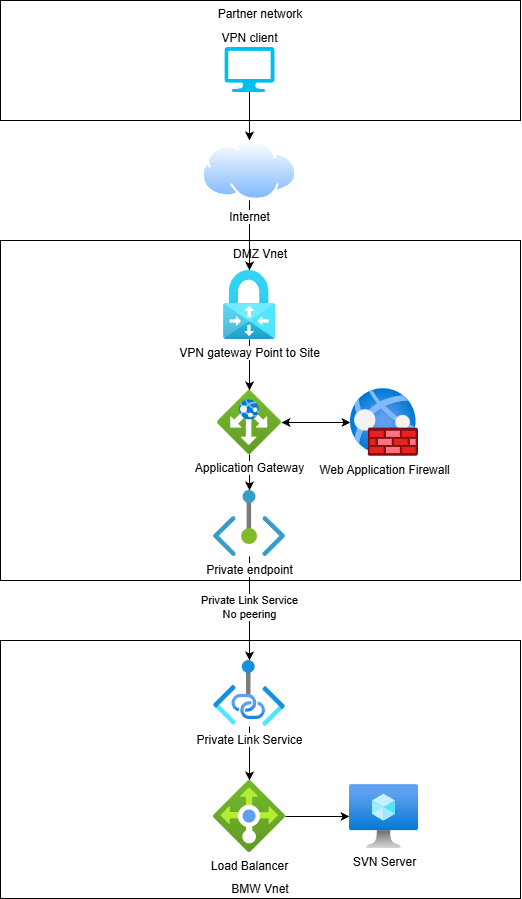

# SVN Server with VPN Access — Azure Infrastructure

Terraform project that deploys a private SVN server on Azure, accessible only through a Point-to-Site VPN connection. Traffic flows through an Application Gateway (WAF) and crosses VNet boundaries via Private Link — the two virtual networks are **fully isolated** and can only communicate over the published port 80.

## Architecture Diagram



## Traffic Flow

```
VPN Client (172.16.0.0/24)
    │
    │  OpenVPN / Entra ID auth
    ▼
┌─────────────────────────────────────────────────────────────────┐
│  vnet-dmz  (10.1.0.0/16)                                        │
│                                                                 │
│  ┌───────────────────────┐                                      │
│  │ VPN Gateway (vpng-dmz)│  GatewaySubnet 10.1.0.0/27           │
│  └──────────┬────────────┘                                      │
│             │ private IP                                        │
│             ▼                                                   │
│  ┌──────────────────────────────────┐                           │
│  │ App Gateway (agw-dmz) — WAF_v2   │  snet-appgw 10.1.1.0/24   │
│  │  listener: HTTP :80 (private)    │                           │
│  │  backend pool ──► PE IP          │                           │
│  └──────────┬───────────────────────┘                           │
│             │                                                   │
│             ▼                                                   │
│  ┌───────────────────────────┐                                  │
│  │ Private Endpoint (pep-svn)│  snet-pe  10.1.2.0/24            │
│  └──────────┬────────────────┘                                  │
│             │                                                   │
└─────────────┼───────────────────────────────────────────────────┘
              │  Azure Private Link (cross-VNet, no peering)
┌─────────────┼───────────────────────────────────────────────────┐
│  vnet-bmw  (10.2.0.0/16)                                        │
│             │                                                   │
│  ┌──────────▼────────────────────┐                              │
│  │ Private Link Service (pls-svn)│  snet-pls  10.2.0.0/24       │
│  └──────────┬────────────────────┘                              │
│             │                                                   │
│             ▼                                                   │
│  ┌────────────────────────────┐                                 │
│  │ Internal LB (lbi-svn)      │  frontend in snet-pls           │
│  │  rule: TCP :80 → :80       │                                 │
│  └──────────┬─────────────────┘                                 │
│             │                                                   │
│             ▼                                                   │
│  ┌──────────────────────┐                                       │
│  │ VM (vm-svn)          │  snet-svn  10.2.1.0/24                │
│  │ Windows Server 2022  │                                       │
│  │ SVN listening on :80 │                                       │
│  └──────────────────────┘                                       │
│                                                                 │
└─────────────────────────────────────────────────────────────────┘
```

### Step by step

1. **VPN Client → VPN Gateway** — The user connects from their machine using the Azure VPN Client. Authentication is handled by Entra ID (OpenVPN protocol). The client receives an IP from `172.16.0.0/24` and gets a route to the DMZ VNet.
2. **VPN Gateway → Application Gateway** — Traffic on port 80 is routed to the Application Gateway's private frontend IP in `snet-appgw`. The WAF (Detection mode, OWASP 3.2) inspects the request.
3. **Application Gateway → Private Endpoint** — The App Gateway's backend pool contains the IP of the Private Endpoint (`pep-svn`) in `snet-pe`. It forwards HTTP traffic on port 80 to this address.
4. **Private Endpoint → Private Link Service** — The Private Endpoint connects to the Private Link Service (`pls-svn`) in `vnet-bmw` via Azure Private Link. This is the **only** path between the two VNets — there is no VNet peering and no other connectivity.
5. **Private Link Service → Internal Load Balancer** — The PLS is fronted by the internal Standard Load Balancer (`lbi-svn`) with its frontend in `snet-pls`.
6. **Load Balancer → VM** — The LB rule forwards TCP port 80 to the backend pool containing the SVN server VM (`vm-svn`) in `snet-svn`.

## Authentication

Access to the SVN server requires passing through **two independent authentication layers**:

1. **Network level — Entra ID (Azure AD)** — Before any traffic can reach the infrastructure, the user must authenticate via the Azure VPN Client using Entra ID. The VPN Gateway (`vpng-dmz`) is configured with OpenVPN protocol and AAD-based auth (`vpn_auth_types = ["AAD"]`). Only users who successfully authenticate against the configured Entra ID tenant receive a VPN tunnel and an IP from the `172.16.0.0/24` pool. Without this step, the Application Gateway's private frontend is unreachable.

2. **Application level — SVN built-in authentication** — Once the VPN tunnel is established and the HTTP request reaches the SVN server (`vm-svn`) through the App Gateway → Private Link → LB chain, the user must authenticate again using SVN's own credentials. This is standard SVN authentication (typically `htpasswd`-based or LDAP-backed, depending on server configuration) and is completely independent of Entra ID. The SVN server challenges the client with an HTTP `401 Unauthorized` response, and the SVN client supplies the username/password configured in its local credentials store.

This means a compromised VPN account alone is not sufficient to access repository contents — valid SVN credentials are also required. Conversely, having SVN credentials is useless without VPN access to the network.

## Network Isolation

The two VNets (`vnet-dmz` and `vnet-bmw`) are **not peered** and have **no shared routing**. The only communication path is through the Private Link connection, which exclusively carries TCP port 80 traffic. NSGs further restrict:

- **nsg-appgw** — allows inbound port 80 from `VirtualNetwork` and App Gateway management ports.
- **nsg-svn** — allows inbound port 80 only from `AzureLoadBalancer` and the PLS subnet (`10.2.0.0/24`).

## Project Layout

```
├── main.tf                 # Root module — wires all phases together
├── variables.tf            # Input variables with defaults
├── outputs.tf              # Root outputs
├── terraform.tfvars        # Environment-specific values
├── providers.tf            # AzureRM provider config
└── modules/
    ├── networking/         # VNets, subnets, NSGs
    ├── vpn-gateway/        # P2S VPN Gateway with Entra ID auth
    ├── app-gateway/        # Application Gateway (WAF_v2) + WAF policy
    ├── private-endpoint/   # Private Endpoint in DMZ VNet
    └── svn-server/         # VM, NIC, internal LB, PLS
```

Modules are deployed in order: **networking → vpn-gateway → svn-server → private-endpoint → app-gateway**.

## Usage

```bash
# Set variables
cp terraform.tfvars.example terraform.tfvars   # edit with real values

# Deploy
terraform init
terraform plan
terraform apply
```

The `vm_admin_password` in `terraform.tfvars` must be changed before deploying.
